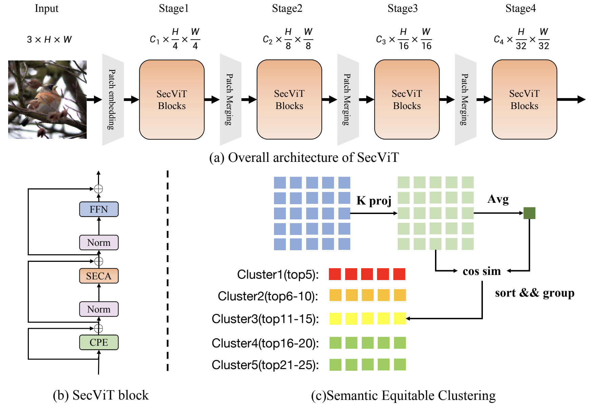

# SecViT
official code for "Semantic Equitable Clustering: A Simple, Fast and Effective Strategy for Vision Transformer"

[Arxiv](https://arxiv.org/abs/2405.13337)

## Abstract
The Vision Transformer (ViT) has gained prominence for its superior relational modeling prowess. However, its global attention mechanism’s quadratic complexity poses substantial computational burdens. A common remedy spatially groups tokens for self-attention, reducing computational requirements. Nonetheless, this strategy neglects semantic information in tokens, possibly scattering semantically-linked tokens across distinct groups, thus compromising the efficacy of self-attention intended for modeling inter-token dependencies. Motivated by
these insights, we introduce a fast and balanced clustering method, named Semantic Equitable Clustering (SEC). SEC clusters tokens based on their global semantic relevance in an efficient, straightforward manner. In contrast to traditional clustering methods requiring multiple iterations, our method achieves token clustering in a single pass. Additionally, SEC regulates the number of tokens per cluster, ensuring a balanced distribution for effective parallel processing on current computational platforms without necessitating further optimization. Capitalizing on SEC, we propose a versatile vision backbone, SecViT. Comprehensive experiments in image classification, object detection, instance segmentation, and semantic segmentation validate to the effectiveness of SecViT. Remarkably, SecViT attains an impressive 84.2% image classification accuracy with only 27M parameters and 4.4G FLOPs, without the need for for additional supervision or data.

### Results
|Model|Params|FLOPs|Acc|log|
|:---:|:---:|:---:|:---:|:---:|
|SecViT-T|15M|2.5G|82.6%|[SecViT-T(epoch298)](SecViT_log/SecViT-T.txt)|
|SecViT-S|27M|4.4G|84.2%|[SecViT-S(epoch263)](SecViT_log/SecViT-S.txt)|
|SecViT-B|55M|9.7G|85.0%|[SecViT-B(epoch242)](SecViT_log/SecViT-B.txt)|
|SecViT-L|96M|18.1G|85.6%|[SecViT-L(epoch244)](SecViT_log/SecViT-L.txt)|

## Citation

If you use SecViT in your research, please consider the following BibTeX entry and giving us a star:
```BibTeX
@misc{fan2024semantic,
      title={Semantic Equitable Clustering: A Simple, Fast and Effective Strategy for Vision Transformer}, 
      author={Qihang Fan and Huaibo Huang and Mingrui Chen and Ran He},
      year={2024},
      eprint={2405.13337},
      archivePrefix={arXiv},
      primaryClass={cs.CV}
}
